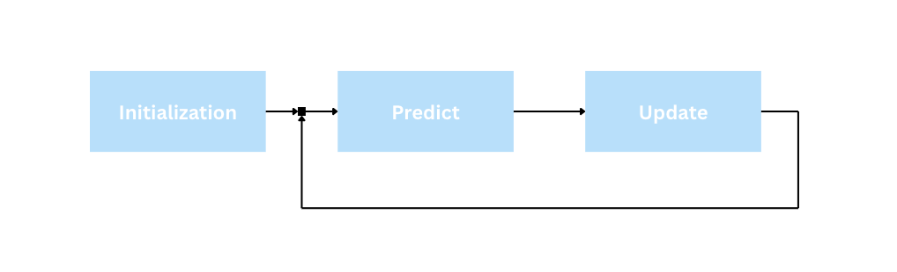
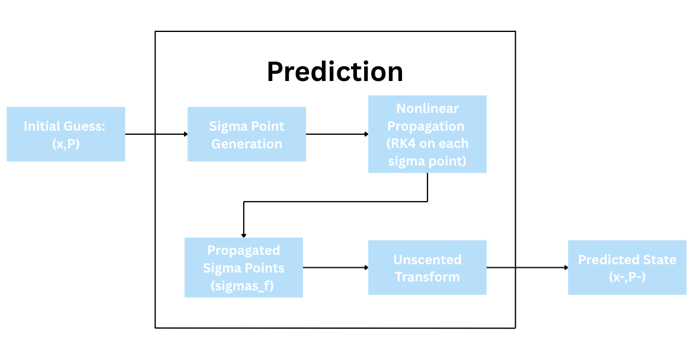
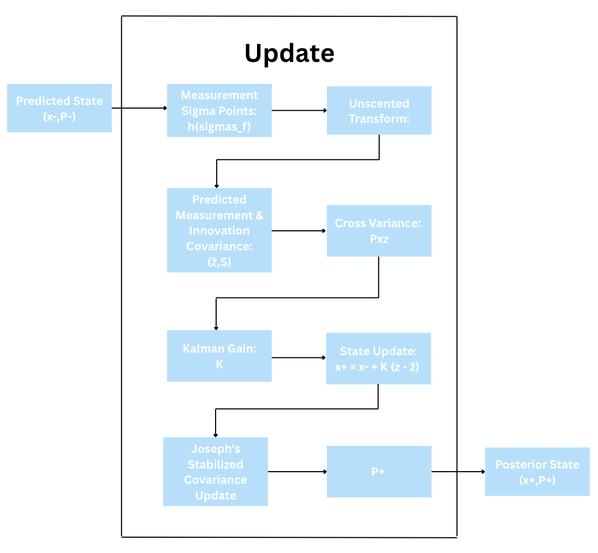

# Unscented Kalman Filter (UKF) in C

A from-scratch implementation of an Unscented Kalman Filter (UKF) in **C**, designed for nonlinear state estimation in embedded / aerospace applications.

This project was developed as part of a rocket state estimation effort and includes:
- Sigma point generation (Merwe scaled sigma points)
- RK4-based nonlinear state propagation
- Joseph-stabilized covariance update
- Cholesky-based Kalman gain computation
- Full predict/update loop with tunable noise models

No external math libraries. No magic. Just linear algebra, pain, and eventual convergence.

---

## State Definition

The current implementation estimates a 3-state system:

$$x = \begin{bmatrix} s \\ v \\ a \end{bmatrix} = \begin{bmatrix} \text{altitude} \\ \text{velocity} \\ \text{acceleration} \end{bmatrix}$$

## File Structure

```text
.
├── src/            # All source files
├── include/        # All header files
├── Images/         # Architecture diagrams
├── Makefile
├── README.md
└── run.sh
```

## High-Level Architecture


## Predict Function Architecture



## Update Function Architecture
